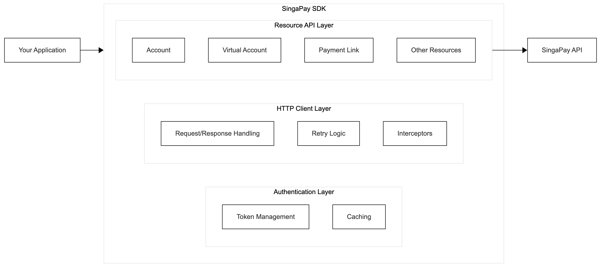

# SingaPay PHP SDK - Complete Documentation

## Table of Contents

- [Introduction](#introduction)
- [Installation](#installation)
- [Configuration](#configuration)
- [Authentication](#authentication)
- [Core Features](#core-features)
- [Account Management](#account-management)
- [Virtual Accounts](#virtual-accounts)
- [Payment Links](#payment-links)
- [QRIS Payments](#qris-payments)
- [Disbursement](#disbursement)
- [Cardless Withdrawal](#cardless-withdrawal)
- [Balance & Statements](#balance--statements)
- [Error Handling](#error-handling)
- [Webhooks](#webhooks)
- [Advanced Features](#advanced-features)

## Introduction

The SingaPay PHP SDK provides a comprehensive interface for integrating SingaPay payment services into your PHP applications. This SDK handles all the complexity of API communication, authentication, and error handling, allowing you to focus on building your business logic.

### Architecture Overview



## Installation

### System Requirements

- PHP 7.4 or higher
- PHP Extensions:
  - cURL
  - JSON
  - mbstring
- Composer (recommended)

### Installing via Composer

```bash
composer require singapay/payment-gateway
```

### Manual Installation

1. Download the latest release from GitHub
2. Extract to your project directory
3. Include the autoloader:

```php
require_once '/path/to/singapay-sdk/vendor/autoload.php';
```

## Configuration

### Basic Configuration

```php
use SingaPay\SingaPay;

$singapay = new SingaPay([
    'client_id' => 'your-client-id',
    'client_secret' => 'your-client-secret',
    'api_key' => 'your-api-key',
    'hmac_validation_key' => 'your-hmac-key',
    'environment' => 'sandbox', // 'sandbox' or 'production'
]);
```

### Advanced Configuration

```php
$singapay = new SingaPay([
    // Required credentials
    'client_id' => 'your-client-id',
    'client_secret' => 'your-client-secret',
    'api_key' => 'your-api-key',
    'hmac_validation_key' => 'your-hmac-key',

    // Environment
    'environment' => 'sandbox',

    // Optional: Custom base URL
    'base_url' => 'https://custom-api.singapay.id',

    // HTTP client settings
    'timeout' => 60,              // Request timeout in seconds
    'max_retries' => 5,           // Maximum retry attempts
    'retry_delay' => 2000,        // Delay between retries (ms)

    // Authentication settings
    'auto_reauth' => true,        // Auto re-authenticate on 401
    'cache_ttl' => 1800,          // Token cache TTL in seconds

    // Custom headers
    'custom_headers' => [
        'X-Custom-Header' => 'CustomValue',
        'X-App-Version' => '1.0.0',
    ],
]);
```

### Configuration Options Explained

| Option                | Type    | Default   | Description                                   |
| --------------------- | ------- | --------- | --------------------------------------------- |
| `client_id`           | string  | required  | Your SingaPay client ID                       |
| `client_secret`       | string  | required  | Your SingaPay client secret                   |
| `api_key`             | string  | required  | Your SingaPay API key (Partner ID)            |
| `hmac_validation_key` | string  | optional  | Key for webhook signature validation          |
| `environment`         | string  | 'sandbox' | 'sandbox' or 'production'                     |
| `base_url`            | string  | auto      | Custom API base URL                           |
| `timeout`             | integer | 30        | HTTP request timeout in seconds               |
| `max_retries`         | integer | 3         | Maximum retry attempts for failed requests    |
| `retry_delay`         | integer | 1000      | Delay between retries in milliseconds         |
| `auto_reauth`         | boolean | true      | Automatically re-authenticate on token expiry |
| `cache_ttl`           | integer | 3600      | Token cache time-to-live in seconds           |
| `custom_headers`      | array   | []        | Additional headers for all requests           |

### Environment-Specific Configuration

**Development/Sandbox:**

```php
$singapay = new SingaPay([
    'client_id' => getenv('SINGAPAY_CLIENT_ID'),
    'client_secret' => getenv('SINGAPAY_CLIENT_SECRET'),
    'api_key' => getenv('SINGAPAY_API_KEY'),
    'environment' => 'sandbox',
    'timeout' => 60,
    'max_retries' => 5,
]);
```

**Production:**

```php
$singapay = new SingaPay([
    'client_id' => getenv('SINGAPAY_CLIENT_ID'),
    'client_secret' => getenv('SINGAPAY_CLIENT_SECRET'),
    'api_key' => getenv('SINGAPAY_API_KEY'),
    'hmac_validation_key' => getenv('SINGAPAY_HMAC_KEY'),
    'environment' => 'production',
    'timeout' => 30,
    'max_retries' => 3,
]);
```

## Authentication

The SDK handles authentication automatically, but you can also manage it manually.

### Automatic Authentication

```php
// SDK handles authentication automatically
$accounts = $singapay->account->list();
```

### Manual Token Management

```php
// Get current access token
$token = $singapay->getAuth()->getAccessToken();

// Force token refresh
$singapay->flushAuthCache();

// Test connection
$result = $singapay->testConnection();
if ($result['success']) {
    echo "Connection successful!";
} else {
    echo "Connection failed: " . $result['message'];
}
```

### Token Caching

The SDK automatically caches authentication tokens to minimize API calls:

```php
use SingaPay\Cache\RedisCache;
use SingaPay\SingaPay;

// Use Redis for token caching
$redis = new Redis();
$redis->connect('127.0.0.1', 6379);

$cache = new RedisCache($redis);
$singapay = new SingaPay($config);
$singapay->getAuth()->setCache($cache);
```

## Core Features

### Testing Connection

```php
$result = $singapay->testConnection();

if ($result['success']) {
    echo "API connection successful";
    echo "Token obtained: " . ($result['token_obtained'] ? 'Yes' : 'No');
} else {
    echo "Connection failed: " . $result['message'];
    echo "Error code: " . $result['error_code'];
}
```

### Getting Metrics

```php
$metrics = $singapay->getMetrics();

echo "Total Requests: " . $metrics['total_requests'];
echo "Successful: " . $metrics['successful_requests'];
echo "Failed: " . $metrics['failed_requests'];
echo "Avg Response Time: " . $metrics['total_response_time'] / $metrics['total_requests'];
```

## Account Management

### List All Accounts

```php
try {
    $accounts = $singapay->account->list($page = 1, $perPage = 25);

    foreach ($accounts['data'] as $account) {
        echo "Account: " . $account['name'];
        echo "ID: " . $account['id'];
        echo "Status: " . $account['status'];
    }

    // Pagination info
    echo "Total: " . $accounts['pagination']['total'];
    echo "Page: " . $accounts['pagination']['current_page'];

} catch (\SingaPay\Exceptions\ApiException $e) {
    echo "Error: " . $e->getMessage();
}
```

### Get Account Details

```php
try {
    $account = $singapay->account->get('account-id');

    echo "Name: " . $account['name'];
    echo "Email: " . $account['email'];
    echo "Phone: " . $account['phone'];
    echo "Balance: " . $account['balance'];

} catch (\SingaPay\Exceptions\ApiException $e) {
    echo "Error: " . $e->getMessage();
}
```

### Create Account

```php
try {
    $account = $singapay->account->create([
        'name' => 'John Doe',
        'email' => 'john@example.com',
        'phone' => '628123456789',
        'address' => 'Jakarta, Indonesia',
    ]);

    echo "Account created with ID: " . $account['id'];

} catch (\SingaPay\Exceptions\ValidationException $e) {
    echo "Validation Error: " . $e->getMessage();
    print_r($e->getErrors());
}
```

### Update Account Status

```php
try {
    $result = $singapay->account->updateStatus('account-id', 'active');
    // Status can be: 'active' or 'inactive'

    echo "Account status updated successfully";

} catch (\SingaPay\Exceptions\ApiException $e) {
    echo "Error: " . $e->getMessage();
}
```

### Delete Account

```php
try {
    $result = $singapay->account->delete('account-id');
    echo "Account deleted successfully";
} catch (\SingaPay\Exceptions\ApiException $e) {
    echo "Error: " . $e->getMessage();
}
```

## Virtual Accounts

### List Virtual Accounts

```php
$virtualAccounts = $singapay->virtualAccount->list('account-id', $page = 1, $perPage = 25);

foreach ($virtualAccounts['data'] as $va) {
    echo "VA Number: " . $va['va_number'];
    echo "Bank: " . $va['bank_code'];
    echo "Amount: " . $va['amount'];
    echo "Status: " . $va['status'];
}
```

### Get Virtual Account Details

```php
$va = $singapay->virtualAccount->get('account-id', 'va-id');

echo "VA Number: " . $va['va_number'];
echo "Bank: " . $va['bank_name'];
echo "Amount: " . $va['amount'];
echo "Status: " . $va['status'];
echo "Expired At: " . $va['expired_at'];
```

### Create Virtual Account

**Temporary Virtual Account:**

```php
try {
    $va = $singapay->virtualAccount->create('account-id', [
        'bank_code' => 'BCA',           // Bank code
        'amount' => 100000,             // Amount in IDR
        'kind' => 'temporary',          // 'temporary' or 'permanent'
        'expired_at' => '2024-12-31 23:59:59',
        'reference_number' => 'ORDER-12345',
        'customer_name' => 'John Doe',
        'customer_email' => 'john@example.com',
        'customer_phone' => '628123456789',
        'max_usage' => 1,               // Maximum payment attempts
    ]);

    echo "VA Number: " . $va['va_number'];
    echo "Amount: " . $va['amount'];
    echo "Expired At: " . $va['expired_at'];

} catch (\SingaPay\Exceptions\ValidationException $e) {
    print_r($e->getErrors());
}
```

**Permanent Virtual Account:**

```php
$va = $singapay->virtualAccount->create('account-id', [
    'bank_code' => 'BCA',
    'amount' => 100000,
    'kind' => 'permanent',
    'reference_number' => 'CUSTOMER-001',
    'customer_name' => 'Jane Doe',
]);

echo "Permanent VA: " . $va['va_number'];
```

### Update Virtual Account

```php
$va = $singapay->virtualAccount->update('account-id', 'va-id', [
    'amount' => 150000,
    'expired_at' => '2024-12-31 23:59:59',
    'customer_name' => 'Updated Name',
]);
```

### Delete Virtual Account

```php
$singapay->virtualAccount->delete('account-id', 'va-id');
```

## Payment Links

### List Payment Links

```php
$paymentLinks = $singapay->paymentLink->list('account-id', $page = 1, $perPage = 25);

foreach ($paymentLinks['data'] as $link) {
    echo "Title: " . $link['title'];
    echo "URL: " . $link['payment_url'];
    echo "Amount: " . $link['total_amount'];
    echo "Status: " . $link['status'];
}
```

### Get Payment Link Details

```php
$link = $singapay->paymentLink->get('account-id', 'payment-link-id');

echo "Payment URL: " . $link['payment_url'];
echo "QR Code: " . $link['qr_code_url'];
echo "Status: " . $link['status'];
```

### Create Payment Link

```php
try {
    $paymentLink = $singapay->paymentLink->create('account-id', [
        'reff_no' => 'PL-' . time(),
        'title' => 'Product Purchase',
        'description' => 'Purchase of premium products',
        'total_amount' => 250000,
        'items' => [
            [
                'name' => 'Premium Product A',
                'description' => 'High quality product',
                'quantity' => 2,
                'unit_price' => 100000,
            ],
            [
                'name' => 'Product B',
                'quantity' => 1,
                'unit_price' => 50000,
            ],
        ],
        'customer_name' => 'John Doe',
        'customer_email' => 'john@example.com',
        'customer_phone' => '628123456789',
        'expired_at' => '2024-12-31 23:59:59',
        'max_usage' => 10,              // Maximum payment attempts
        'payment_methods' => ['va', 'qris', 'ewallet'],
    ]);

    echo "Payment Link: " . $paymentLink['payment_url'];
    echo "QR Code: " . $paymentLink['qr_code_url'];

} catch (\SingaPay\Exceptions\ValidationException $e) {
    print_r($e->getErrors());
}
```

### Update Payment Link

```php
$link = $singapay->paymentLink->update('account-id', 'payment-link-id', [
    'title' => 'Updated Title',
    'description' => 'Updated description',
    'expired_at' => '2025-01-31 23:59:59',
]);
```

### Delete Payment Link

```php
$singapay->paymentLink->delete('account-id', 'payment-link-id');
```

### Get Available Payment Methods

```php
$methods = $singapay->paymentLink->getAvailablePaymentMethods();

foreach ($methods as $method) {
    echo "Code: " . $method['code'];
    echo "Name: " . $method['name'];
    echo "Type: " . $method['type'];
}
```

## QRIS Payments

### List QRIS Transactions

```php
$qrisList = $singapay->qris->list('account-id', $page = 1, $perPage = 25);

foreach ($qrisList['data'] as $qris) {
    echo "QR String: " . $qris['qr_string'];
    echo "Amount: " . $qris['amount'];
    echo "Status: " . $qris['status'];
}
```

### Get QRIS Details

```php
$qris = $singapay->qris->get('account-id', 'qris-id');

echo "QR Image URL: " . $qris['qr_image_url'];
echo "QR String: " . $qris['qr_string'];
echo "Amount: " . $qris['amount'];
```

### Generate Dynamic QRIS

```php
try {
    $qris = $singapay->qris->generate('account-id', [
        'amount' => 100000,
        'reference_number' => 'QR-' . time(),
        'customer_name' => 'John Doe',
        'expired_at' => '2024-12-31 23:59:59',
        'description' => 'Payment for products',
        'tip_indicator' => 'fixed_amount', // or 'percentage'
        'tip_value' => 5000,
    ]);

    echo "QR Code URL: " . $qris['qr_image_url'];
    echo "QR String: " . $qris['qr_string'];

} catch (\SingaPay\Exceptions\ValidationException $e) {
    print_r($e->getErrors());
}
```

### Delete QRIS

```php
$singapay->qris->delete('qris-id');
```

## Disbursement

### List Disbursements

```php
$disbursements = $singapay->disbursement->list('account-id', $page = 1, $perPage = 25);

foreach ($disbursements['data'] as $disbursement) {
    echo "Transaction ID: " . $disbursement['transaction_id'];
    echo "Amount: " . $disbursement['amount'];
    echo "Bank: " . $disbursement['bank_name'];
    echo "Status: " . $disbursement['status'];
}
```

### Get Disbursement Details

```php
$disbursement = $singapay->disbursement->get('account-id', 'transaction-id');

echo "Amount: " . $disbursement['amount'];
echo "Fee: " . $disbursement['fee'];
echo "Status: " . $disbursement['status'];
echo "Beneficiary: " . $disbursement['beneficiary_name'];
```

### Check Transfer Fee

```php
$feeInfo = $singapay->disbursement->checkFee(
    'account-id',
    100000,        // Amount
    'BRINIDJA'    // Bank SWIFT code
);

echo "Transfer Fee: " . $feeInfo['fee'];
echo "Total Amount: " . $feeInfo['total_amount'];
```

### Check Beneficiary Account

```php
$beneficiary = $singapay->disbursement->checkBeneficiary(
    '1234567890',  // Bank account number
    'BRINIDJA'     // Bank SWIFT code
);

echo "Account Name: " . $beneficiary['account_name'];
echo "Bank Name: " . $beneficiary['bank_name'];
echo "Valid: " . ($beneficiary['is_valid'] ? 'Yes' : 'No');
```

### Transfer Funds

```php
try {
    $transfer = $singapay->disbursement->transfer('account-id', [
        'amount' => 100000,
        'bank_swift_code' => 'BRINIDJA',
        'bank_account_number' => '1234567890',
        'bank_account_name' => 'Jane Doe',
        'reference_number' => 'TRX-' . time(),
        'description' => 'Payment for services',
        'customer_reference' => 'CUST-001',
    ]);

    echo "Transaction ID: " . $transfer['transaction_id'];
    echo "Status: " . $transfer['status'];

} catch (\SingaPay\Exceptions\ValidationException $e) {
    print_r($e->getErrors());
}
```

## Cardless Withdrawal

### List Cardless Withdrawals

```php
$withdrawals = $singapay->cardlessWithdrawal->list('account-id', $page = 1, $perPage = 25);
```

### Create Cardless Withdrawal

```php
$withdrawal = $singapay->cardlessWithdrawal->create('account-id', [
    'withdraw_amount' => 500000,
    'payment_vendor_code' => 'ATM_BERSAMA',
    'customer_phone' => '628123456789',
    'reference_number' => 'WD-' . time(),
]);

echo "Withdrawal Code: " . $withdrawal['withdrawal_code'];
```

### Cancel Withdrawal

```php
$singapay->cardlessWithdrawal->cancel('account-id', 'transaction-id');
```

## Balance & Statements

### Check Account Balance

```php
$balance = $singapay->balanceInquiry->getAccountBalance('account-id');

echo "Available Balance: " . $balance['available_balance'];
echo "Pending Balance: " . $balance['pending_balance'];
echo "Total Balance: " . $balance['total_balance'];
```

### Check Merchant Balance

```php
$balance = $singapay->balanceInquiry->getMerchantBalance();

echo "Total Balance: " . $balance['balance'];
```

### List Statements

```php
$statements = $singapay->statement->list('account-id', $page = 1, $perPage = 25, [
    'start_date' => '2024-01-01',
    'end_date' => '2024-12-31',
]);

foreach ($statements['data'] as $statement) {
    echo "Date: " . $statement['transaction_date'];
    echo "Type: " . $statement['transaction_type'];
    echo "Amount: " . $statement['amount'];
    echo "Balance: " . $statement['running_balance'];
}
```

## Error Handling

### Exception Hierarchy

```
\Exception
    └── SingaPayException
            ├── ApiException
            ├── AuthenticationException
            └── ValidationException
```

### Handling Specific Exceptions

```php
use SingaPay\Exceptions\ValidationException;
use SingaPay\Exceptions\AuthenticationException;
use SingaPay\Exceptions\ApiException;

try {
    $result = $singapay->account->create($data);

} catch (ValidationException $e) {
    // Handle validation errors
    echo "Validation failed: " . $e->getMessage();
    foreach ($e->getErrors() as $field => $error) {
        echo "{$field}: {$error}";
    }

} catch (AuthenticationException $e) {
    // Handle authentication errors
    echo "Authentication failed: " . $e->getMessage();
    // Maybe redirect to login or refresh credentials

} catch (ApiException $e) {
    // Handle API errors
    echo "API Error: " . $e->getMessage();
    echo "HTTP Status: " . $e->getCode();

} catch (\Exception $e) {
    // Handle unexpected errors
    echo "Unexpected error: " . $e->getMessage();
}
```

### Error Response Structure

```php
try {
    $result = $singapay->account->create($invalidData);
} catch (ValidationException $e) {
    $errors = $e->getErrors();
    /*
    Array format:
    [
        'email' => 'Email must be a valid email address',
        'phone' => 'Phone must be 9-15 digits',
        'items.0.quantity' => 'Item quantity must be numeric'
    ]
    */
}
```

## Webhooks

### Verifying Webhook Signature

```php
// Receive webhook data
$timestamp = $_SERVER['HTTP_X_TIMESTAMP'];
$signature = $_SERVER['HTTP_X_SIGNATURE'];
$body = file_get_contents('php://input');

// Verify signature
$isValid = $singapay->verifyWebhookSignature($timestamp, $body, $signature);

if ($isValid) {
    $data = json_decode($body, true);

    // Process webhook data
    switch ($data['event_type']) {
        case 'payment.success':
            // Handle successful payment
            break;
        case 'payment.failed':
            // Handle failed payment
            break;
        case 'disbursement.completed':
            // Handle completed disbursement
            break;
    }

    http_response_code(200);
    echo json_encode(['status' => 'success']);
} else {
    http_response_code(401);
    echo json_encode(['error' => 'Invalid signature']);
}
```

### Webhook Event Types

| Event Type               | Description                    |
| ------------------------ | ------------------------------ |
| `payment.success`        | Payment completed successfully |
| `payment.failed`         | Payment failed                 |
| `payment.expired`        | Payment link or VA expired     |
| `disbursement.completed` | Disbursement completed         |
| `disbursement.failed`    | Disbursement failed            |
| `va.created`             | Virtual account created        |
| `va.paid`                | Virtual account paid           |

## Advanced Features

### Using Custom Cache

```php
use SingaPay\Cache\RedisCache;

$redis = new Redis();
$redis->connect('127.0.0.1', 6379);

$cache = new RedisCache($redis, 'my_app_');
$singapay->getAuth()->setCache($cache);
```

### Request Interceptors

```php
use SingaPay\Http\InterceptorInterface;

class CustomInterceptor implements InterceptorInterface
{
    public function request($method, $endpoint, $options)
    {
        // Log or modify request
        error_log("Request: {$method} {$endpoint}");
    }

    public function response($method, $endpoint, $options, $response)
    {
        // Log or process response
        error_log("Response: " . $response->getStatusCode());
    }

    public function error($method, $endpoint, $options, $exception)
    {
        // Log errors
        error_log("Error: " . $exception->getMessage());
    }
}

$singapay->addInterceptor(new CustomInterceptor());
```

### Multiple Configurations

```php
use SingaPay\SingaPayFactory;

// Set default config
SingaPayFactory::setDefaultConfig($defaultConfig);

// Create multiple instances
$clientA = SingaPayFactory::create($configA, 'client_a');
$clientB = SingaPayFactory::create($configB, 'client_b');

// Retrieve instances
$clientA = SingaPayFactory::get('client_a');
```

---

For more information, visit [SingaPay Developer Portal](https://developer.singapay.id)
